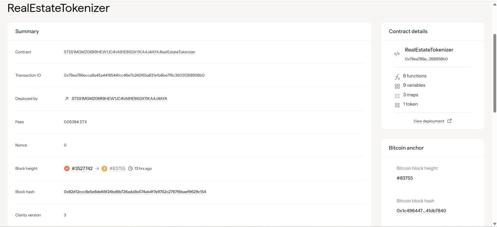

# RealEstate Tokenizer

## Project Description
Tokenize real estate properties enabling fractional ownership and liquid real estate investment. This smart contract allows property owners to convert their real estate assets into digital tokens, enabling investors to purchase fractional ownership stakes and participate in the real estate market with lower capital requirements.

## Project Vision
To democratize real estate investment by breaking down traditional barriers to entry, making property investment accessible to everyone regardless of their financial capacity. Our vision is to create a liquid, transparent, and efficient real estate investment ecosystem where:

- **Accessibility**: Anyone can invest in premium real estate with minimal capital
- **Liquidity**: Real estate investments become as liquid as traditional securities
- **Transparency**: All transactions and ownership records are immutable and publicly verifiable
- **Global Reach**: Investors can participate in real estate markets worldwide
- **Fractional Ownership**: Properties are divided into affordable investment units
- **Automated Compliance**: Smart contracts ensure regulatory compliance and automated profit distribution

## Future Scope

### Phase 1 - Enhanced Features
- **Rental Revenue Distribution**: Automated distribution of rental income to token holders
- **Property Valuation Updates**: Integration with real estate APIs for dynamic property valuations
- **Secondary Market Trading**: Enable peer-to-peer trading of property tokens
- **Governance Rights**: Token holders can vote on property management decisions

### Phase 2 - Advanced Functionality  
- **Multi-Property Portfolios**: Create diversified real estate investment bundles
- **Insurance Integration**: Built-in property insurance mechanisms
- **Loan Against Tokens**: Use property tokens as collateral for loans
- **Cross-Chain Compatibility**: Enable trading across multiple blockchain networks

### Phase 3 - Ecosystem Expansion
- **Real Estate Oracle Network**: Real-time property data feeds
- **DeFi Integration**: Yield farming and staking mechanisms for property tokens
- **Mobile Application**: User-friendly mobile interface for property investment
- **Institutional Features**: Advanced tools for institutional investors
- **Regulatory Compliance**: Full compliance with international real estate regulations
- **Property Management DAO**: Decentralized autonomous organization for property governance

### Phase 4 - Global Platform
- **Multi-Currency Support**: Accept various cryptocurrencies and fiat currencies
- **Real Estate Marketplace**: Complete platform for property listing, discovery, and investment
- **AI-Powered Analytics**: Machine learning for property valuation and investment recommendations
- **Virtual Property Tours**: Integration with VR/AR for remote property viewing
- **Legal Framework Integration**: Automated legal documentation and compliance

## Core Functions

### 1. `tokenize-property`
- **Purpose**: Allows property owners to tokenize their real estate
- **Parameters**: 
  - `property-address`: Physical address of the property
  - `total-value`: Total value of the property in STX
  - `total-tokens`: Number of tokens to create for fractional ownership
- **Returns**: Property ID for the newly tokenized property

### 2. `buy-property-tokens`
- **Purpose**: Enables investors to purchase fractional ownership tokens
- **Parameters**:
  - `property-id`: ID of the property to invest in
  - `token-amount`: Number of tokens to purchase
- **Returns**: Success confirmation after token purchase

## Read-Only Functions
- `get-property-info`: Retrieve detailed information about a property
- `get-user-property-tokens`: Check user's token holdings for specific property
- `get-total-properties`: Get the total number of tokenized properties
- `get-token-balance`: Check user's total property token balance

## Contract Address Details
Contract ID: STSS1MGMZ06R9HEW1JC4VA91E9SGX11KAAJ4AYA.RealEstateTokenizer

